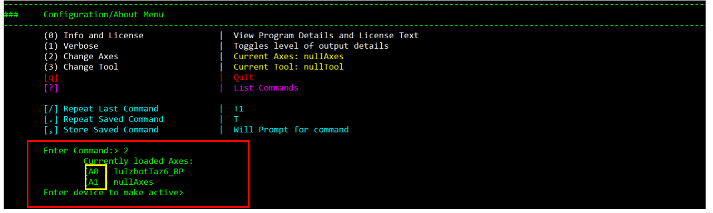
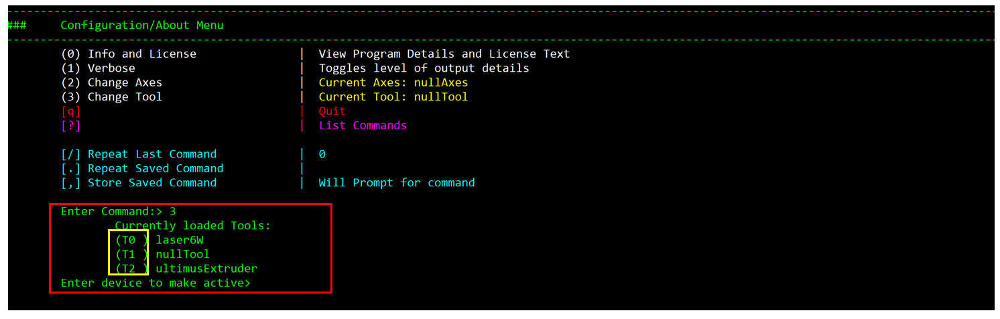

Configuration/About Menu
========================

The configuration/about menu **Configure/About Menu** allows users to view program and license information about Polychemprint3. This menu also includes options to change the level of output details, and switch axes and tools the program is controlling. 
Here is what Configuration/About Menu looks like:

.. image:: /images/configuration.png

View Program Details and License Text
#####################################

By typing command **0** in **Configuration/About Menu**, program details and license text will be displayed on the terminal like the following:

.. image:: /images/license.png

Change Level of Output Detail
#############################

By entering command **1** in **Configure/About Menu**, the amount of details presented in the program will be altered. Currently, only two levels of output details exit: “more” level and “less” level. Whether this alternation increases or reduce amount of information displayed depends on the current level of output details. If the program is in the “more” level, type in **1** will change to “less” level and vice versa.  

.. image:: /images/outputlevel.png

Change Axes and Tool 
####################

Command **2** and **3** in **Configure/About Menu** change the axes and tool that polychemprint3 is controlling. Axes represents the hardware in charge of movements, for example if polychemprint 3 is controlling a 3D printer, axes should be set to that 3D printer since it controls movement in x, y, and z directions. In order to change the axes, type **2** in the command line and terminal will display all the axes that is loaded into polychemprint3 and ask for user input to select the device need to be activate like the following(boxed in yellow): 

Right now, the program is loaded with two axes: lulzbotTaz6_BP and nullAxes. To select the desired axes, simply type in the corresponding commands (boxed in yellow) on the left of axes names, in this case **A0** or **A1**. 
Tools are hardware that does not control movement. For example, in laser cutting, the amount of energy emitted need to be controlled, so laser will be tool in this case. The change tool procedure works the same way as change axes: type **3** in command and select the desired tool using commands show on the left of tool name (boxed in yellow). 

